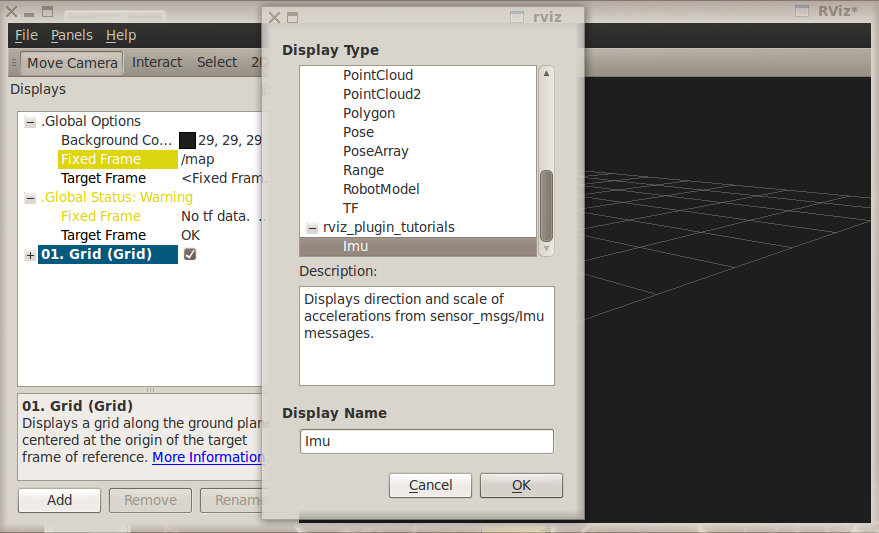

ImuDisplay
==========

Overview
--------

This tutorial shows how to write a simple Display plugin for RViz.

RViz does not currently have a way to display sensor_msgs/msg/Imu messages directly.
The code in this tutorial implements a subclass of rviz_common::Display to do so.

The source code for this tutorial is in the rviz_plugin_tutorials package.
You can check out the source directly or (if you use Ubuntu) you can just apt-get install the pre-compiled Debian package like so::

    sudo apt-get install ros-galactic-visualization-tutorials

Here is what the new ImuDisplay output looks like, showing a sequence of sensor_msgs/msg/Imu messages from the test script:

.. image:: imu_arrows.png

The Plugin Code
---------------

The code for ImuDisplay is in these files: 
:srcdir:`src/imu_display.hpp`,
:srcdir:`src/imu_display.cpp`,
:srcdir:`src/imu_visual.hpp`, and
:srcdir:`src/imu_visual.cpp`.

imu_display.hpp
^^^^^^^^^^^^^^^

The full text of imu_display.hpp is here: :srcdir:`src/imu_display.hpp`

.. tutorial-formatter:: ../imu_display.hpp

imu_display.cpp
^^^^^^^^^^^^^^^

The full text of imu_display.cpp is here: :srcdir:`src/imu_display.cpp`

.. tutorial-formatter:: ../imu_display.cpp

imu_visual.hpp
^^^^^^^^^^^^^^

The full text of imu_visual.hpp is here: :srcdir:`src/imu_visual.hpp`

.. tutorial-formatter:: ../imu_visual.hpp

imu_visual.cpp
^^^^^^^^^^^^^^

The full text of imu_visual.cpp is here: :srcdir:`src/imu_visual.cpp`

.. tutorial-formatter:: ../imu_visual.cpp

.. include:: building_and_exporting.rst

Trying It Out
-------------

Once your RViz plugin is compiled and exported, simply run rviz normally::

    rviz2

and RViz will use pluginlib to find all the plugins exported to it.

Add an ImuDisplay by clicking the "Add" button at the bottom of the "Displays" panel (or by typing Control-N).
Scroll down through the available displays until you see "Imu" under your plugin package name (here it is "rviz_plugin_tutorials").

If "Imu" is not in your list of Display Types, look through RViz's console output for error messages relating to plugin loading.
Some common problems are:

- not having a plugin_description.xml file,
- not exporting it in the CMakeLists.txt file, or
- not properly referencing the library file (like
  rviz_plugin_tutorials.so) from plugin_description.xml.

Once you've added the Imu display to RViz, you just need to set the topic name of the display to a source of sensor_msgs/msg/Imu messages.

If you don't happen to have an IMU or other source of sensor_msgs/msg/Imu messages, you can test the plugin with a Python script like this:
:srcdir:`scripts/send_test_msgs.py`.

The script publishes on the "/test_imu" topic, so enter that.

The script publishes both Imu messages and a moving TF frame ("/base_link" relative to "/map"), so make sure your "Fixed Frame" is set to "/map".

Finally, adjust the "History Length" parameter of the Imu display to 10 and you should see something like the picture at the top of this page.

Note: If you use this to visualize messages from an *actual* IMU, the arrows are going to be huge compared to most robots:

.. image:: real_imu.png

(Note the PR2 robot at the base of the purple arrow.)
This is because the Imu acceleration units are meters per second squared, and gravity is 9.8 m/s^2, and we haven't applied any scaling or gravity compensation to the acceleration vectors.

Next Steps
----------

This ImuDisplay is not yet a terribly useful Display class.
Extensions to make it more useful might be:

- Add a gravity-compensation option to the acceleration vector.
- Visualize more of the data in the Imu messages.

To add a gravity compensation option, you might take steps like these:

- Add a new ``rviz_common::BoolProperty`` to ImuDisplay to store whether the option is on or off.
- Compute the direction of gravity relative to the Imu frame orientation (as set in ImuVisual::setFrameOrientation()) and subtract it from the acceleration vector each time in ImuVisual::setMessage().

Since ImuVisual takes complete Imu messages as input, adding visualizations of more of the Imu data only needs modifications to ImuVisual.
Imu data displays might look like:

- orientation: An rviz_common::Axes object at the Imu reference frame, turned to show the orientation.
- angular_velocity: Maybe a line to show the axis of rotation and a 3D arrow curving around it to show the speed of rotation?
- orientation_covariance: Maybe this is an ellipse at the end of each of the X, Y, and Z axes showing the orientation?
- linear_acceleration_covariance: Maybe this is an ellipsoid at the end of the acceleration arrow?

As all this might be visually cluttered, it may make sense to include boolean options to enable or disable some of them.
