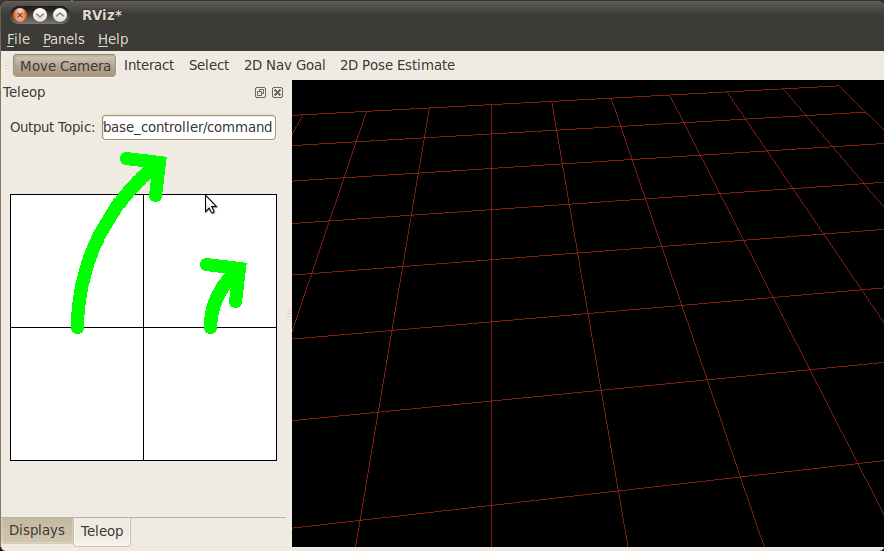
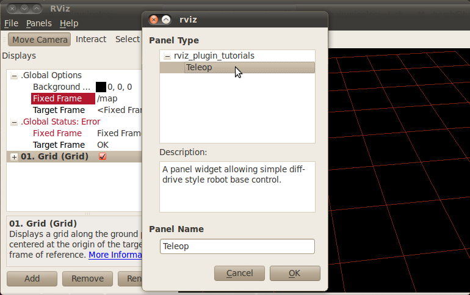

TeleopPanel
===========

Overview
--------

This tutorial shows how to write a simple Panel plugin for RViz.

A *panel* in RViz is a GUI widget which can be docked in the main
window or floating.  It does not show properties in the "Displays"
panel like a *Display*, but it could show things in the 3D scene.

A panel can be a useful place to put a bunch of application-specific
GUI elements.  You could put start and stop buttons for your robot, or
other command or control inputs.

RViz has a built-in tool to send a goal pose to a path planner, but it
does not have a native way to send velocity commands directly to a
robot base controller.  That is what this tutorial shows, a subclass
of rviz::Panel which lets you send velocity commands right to your
robot.

The source code for this tutorial is in the rviz_plugin_tutorials
package. You can check out the source directly or (if you use Ubuntu)
you can just apt-get install the pre-compiled Debian package like so::

    sudo apt-get install ros-hydro-visualization-tutorials

Here is what RViz looks like with the new "Teleop" panel showing on
the left:

The Plugin Code
---------------

The code for TeleopPanel is in these files: 
:srcdir:`src/teleop_panel.h`,
:srcdir:`src/teleop_panel.cpp`,
:srcdir:`src/drive_widget.h`, and
:srcdir:`src/drive_widget.cpp`.

teleop_panel.h
^^^^^^^^^^^^^^

The full text of teleop_panel.h is here: :srcdir:`src/teleop_panel.h`

.. tutorial-formatter:: ../teleop_panel.h

teleop_panel.cpp
^^^^^^^^^^^^^^^^

The full text of teleop_panel.cpp is here: :srcdir:`src/teleop_panel.cpp`

.. tutorial-formatter:: ../teleop_panel.cpp

drive_widget.h
^^^^^^^^^^^^^^

The full text of drive_widget.h is here: :srcdir:`src/drive_widget.h`

.. tutorial-formatter:: ../drive_widget.h

drive_widget.cpp
^^^^^^^^^^^^^^^^

The full text of drive_widget.cpp is here: :srcdir:`src/drive_widget.cpp`

.. tutorial-formatter:: ../drive_widget.cpp

.. include:: building_and_exporting.rst

Trying It Out
-------------

Once your RViz plugin is compiled and exported, simply run rviz normally::

    rosrun rviz rviz

and rviz will use pluginlib to find all the plugins exported to it.

Add a Teleop panel by opening the "Panels" menu and then "Add New
Panel" within that.  This should bring up a Panel class chooser dialog
with "Teleop" in it (here it is "rviz_plugin_tutorials"):

If "Teleop" is not in your list of Panel types, look through RViz's
console output for error messages relating to plugin loading.  Some common
problems are:

- not having a plugin_description.xml file,
- not exporting it in the manifest.xml file, or
- not properly referencing the library file (like
  librviz_plugin_tutorials.so) from plugin_description.xml.

Once you've added the Teleop panel to RViz, you just need to enter a
topic name to publish the geometry_msgs/Twist command velocities on.
Once a non-empty string has been entered in the "Output Topic" field,
the control square area should light up and accept mouse events.
Holding the mouse button down in the control area sends a linear
velocity based on the Y position of the mouse relative to the center
and an angular velocity based on the X position of the mouse relative
to the center.

Next Steps
----------

This Teleop panel might be useful as it is, since it already sends out
command velocities appropriate for a diff-drive robot.  However, there
are a few things which might make it more useful:

- Adjustable scaling of the linear and angular velocities.
- Enforced maxima for the velocities.
- An adjustable robot width parameter, so that the curved arrows accurately show the arc a robot would traverse.
- A "strafe" mode (maybe when holding down the Shift key) for robots like the PR2 with (more) holonomic drive ability.
