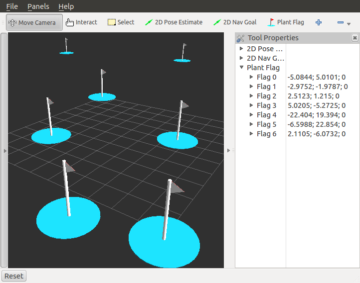

PlantFlagTool
=============

Overview
--------

This tutorial shows how to write a new tool for RViz.

In RViz, a tool is a class that determines how mouse events interact
with the visualizer.  In this example we describe PlantFlagTool which
lets you place "flag" markers in the 3D scene.

The source code for this tutorial is in the rviz_plugin_tutorials
package. You can check out the source directly or (if you use Ubuntu)
you can just apt-get install the pre-compiled Debian package like so::

    sudo apt-get install ros-hydro-visualization-tutorials

Here is an example of what the new PlantFlagTool can do:

The Plugin Code
---------------

The code for PlantFlagTool is in these files: 
:srcdir:`src/plant_flag_tool.h`, and
:srcdir:`src/plant_flag_tool.cpp`.

plant_flag_tool.h
^^^^^^^^^^^^^^^^^

The full text of plant_flag_tool.h is here: :srcdir:`src/plant_flag_tool.h`

.. tutorial-formatter:: ../plant_flag_tool.h

plant_flag_tool.cpp
^^^^^^^^^^^^^^^^^^^

The full text of plant_flag_tool.cpp is here: :srcdir:`src/plant_flag_tool.cpp`

.. tutorial-formatter:: ../plant_flag_tool.cpp

.. include:: building_and_exporting.rst

Trying It Out
-------------

Once your RViz plugin is compiled and exported, simply run rviz normally::

    rosrun rviz rviz

and rviz will use pluginlib to find all the plugins exported to it.

Add a PlantFlag tool by clicking on the "+" button in the toolbar and
selecting "PlantFlag" from the list under your plugin package name
(here it is "rviz_plugin_tutorials").

Once "PlantFlag" is in your toolbar, click it or press "l" (the
shortcut key) to start planting flags.  Open the "Tool Properties"
panel to see the positions of the flags you have planted.

Currently the only way to remove the flags is to delete the PlantFlag
tool, which you do by pressing the "-" (minus sign) button in the
toolbar and selecting "PlantFlag".

Next Steps
----------

PlantFlag as shown here is not terribly useful yet.  Some extensions to make it more useful might be:

- Add the ability to delete, re-position, and re-name existing flags.
- Publish ROS messages with the names and locations of the flags.

To modify existing flags, you might:

- Change processMouseEvent() to notice when the mouse is pointing near an existing flag.
- When it is:

  - make the flag highlight.
  - If the right button is pressed, show a context menu with delete and rename options.
  - If the left button is pressed, begin dragging the existing flag around.

Conclusion
----------

There are many possibilities for new types of interaction with RViz.
We look forward to seeing what you make.
