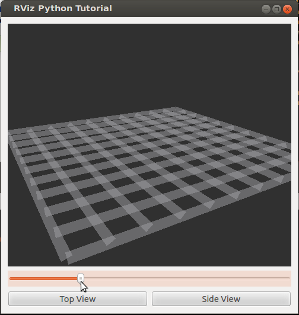

RViz Python Tutorial
====================

Overview
--------

RViz is not just a visualizer application, it is also a Python
library!  Much of RViz's functionality can be accessed from Python
code by importing the librviz Python bindings.

This tutorial shows a simple example of creating a visualizer
(rviz::VisualizationFrame) as a child widget along with other Qt
widgets, programmatically loading a config file, then connecting a
slider and some Qt push buttons to change display a display property
and the viewpoint.

The source code for this tutorial is in the rviz_python_tutorial
package. You can check out the source directly or (if you use Ubuntu)
you can just apt-get install the pre-compiled Debian package like so::

    sudo apt-get install ros-groovy-visualization-tutorials

The running application looks like this:

The Code: myviz.py
------------------

The full text of myviz.py is here: :srcdir:`myviz.py`

.. tutorial-formatter:: ../myviz.py

Running
-------

Just type::

    roscd rviz_python_tutorial
    ./myviz.py

myviz.py loads its config file from the current directory, so you need
to run it from the directory it comes in, or adapt the script to find
the file.

There are more classes in RViz which do not yet have Python bindings.
If you find important ones are missing, please request them as
"enhancement" issues on the RViz project on github.
